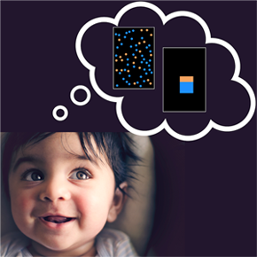
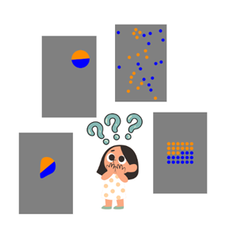
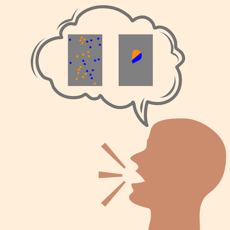

---
title: 
date: 2022-10-24

type: page
--- 

# Our Active Projects

We are excited that you’re interested in our studies! We have different kinds of studies for kids at different ages, but not all studies or study types will be available all the time. A list of our currently available studies is listed below in the [Active Research Studies](#active-research-studies) section.

Some of our studies take place on our partnership website, [Children Helping Science](https://lookit.mit.edu/). For these studies, you can participate anytime and from anywhere that you’d like without a researcher present and without needing to schedule a time. Other studies happen at scheduled times with a researcher, either remotely over video chat or at our in-person lab in the [Psychology building](https://www.google.com/maps/place/Rutgers+University+Psychology+Department/@40.5232415,-74.4706683,17z/data=!3m1!4b1!4m6!3m5!1s0x89c3c7133e5e9717:0xfa2a453e087044e4!8m2!3d40.5232375!4d-74.4657974!16s%2Fg%2F1ypj4nv98?entry=ttu) on Rutgers University’s Busch campus. If you have other questions about participating in our studies, check out our FAQs! 

If you’d like to join our database and hear more about new studies your child might be eligible for, please fill out our [Sign Up Form](https://rutgers.ca1.qualtrics.com/jfe/form/SV_2o6mi1NcKVX7Foa).

# Active Research Studies

Ready to jump in?! Here is a list of our currently available research studies. But don’t worry if you can’t find something for your child - we regularly add new studies for a range of ages! If you’d like to hear about future study opportunities, you can join our database by filling out this [Sign Up Form](https://rutgers.ca1.qualtrics.com/jfe/form/SV_2o6mi1NcKVX7Foa). 

## Do babies pay attention to ratios?

**Ages:** 6 month old babies

**Location:** [Children Helping Science](https://lookit.mit.edu/studies/88a89f9a-2a8f-4592-92d1-052f51b860f9/) – follow the link to sign up and participate anywhere, anytime

**Purpose:** The purpose of this study is to better understand how children reason about numbers. Specifically, this study is about how babies think about ratios like “there are twice as many orange dots as blue dots.” We do this by showing babies pictures of different ratios and measuring how long they pay attention when seeing the same ratio over and over again or a new ratio they haven’t seen yet. For example, “6 orange and 3 blue” is the same ratio as “10 orange and 5 blue” because both are “twice as many orange” but “8 orange and 2 blue” is a new ratio (four times as many orange as blue). We also compare the looking behavior of babies who see color ratios within a single rectangle and babies who see color ratios within a set of dots. Research like this helps us understand babies’ earliest number and math abilities, which helps us learn how math concepts like fractions and counting develop.

## Comparing proportions in different shapes and sizes!

**Ages:** 2.5 to 6-years-old

**Location:** Over video chat with a researcher. Use our [Sign Up form](https://rutgers.ca1.qualtrics.com/jfe/form/SV_2o6mi1NcKVX7Foa) or see our posting on [Children Helping Science](https://childrenhelpingscience.com/studies/7cd2aa34-32e4-4815-8fd8-af13bff04b2d/)!

**Purpose:** Proportions come in so many different shapes and sizes, yet children and adults are often easily able to compare them! A single trip through the grocery store will have you estimating which of two trail mix packages in made up of more raisins, or how much flour you need to double your cake recipe. In this study, we are interested in how people's ability to make decisions with proportions changes as children get older and when the proportions look different.

## Comparing quantities while talking?

**Ages:** 5 to 7-years-old

**Location:** In our lab at Rutgers University, New Bruswick! Use our [Sign Up form](https://rutgers.ca1.qualtrics.com/jfe/form/SV_2o6mi1NcKVX7Foa) and a researcher will reach out to schedule a time.

**Purpose:** Proportional reasoning is important to our everyday lives, but people make a lot of mistakes when evaluating ratios, especially when the ratio in question is broken up into parts. This study is looking to explore the causes of this difficulty. 